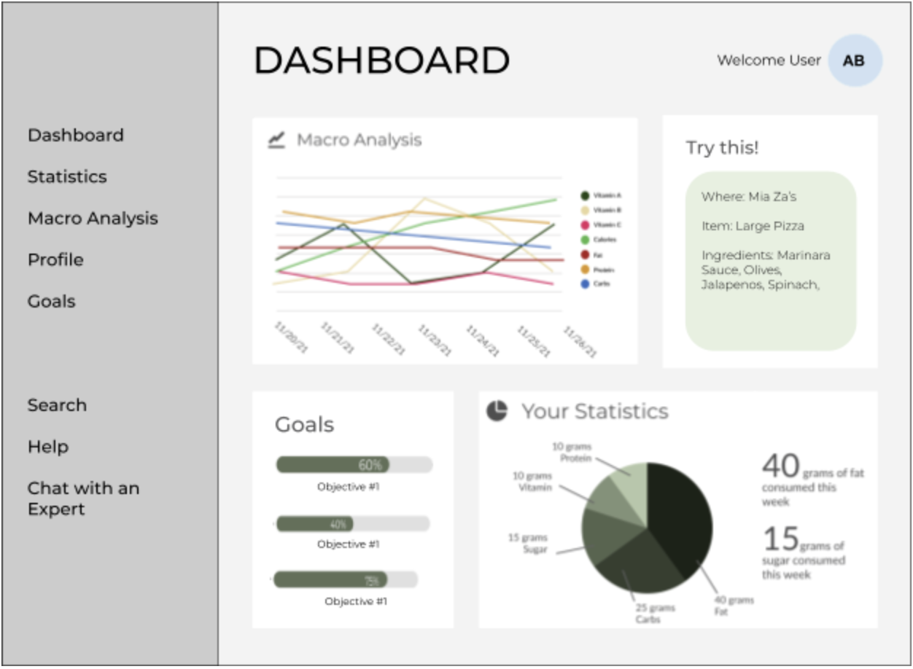

# Macro-Tracker

## Project Summary: 
Our website will be a platform that tracks UIUC students’ macros throughout the day. Typically, when trying to track caloric intake, it can be difficult to find nutrition information specific to the restaurants in your area. It is notably hard for college students who live on campus and eat out often at campus specific go-to restaurants. For this reason, we are building a UIUC campus specific platform that allows students to easily access, store, update, and track their food intake as they eat out around campus.

In order to do this, our platform will provide a dashboard display to easily manage your macros, including carb, fat, and protein content in each meal eaten throughout the day. The database will also keep track of user information such that each student will be able view their personal health profile and goals over time. The app will provide statistics and insights on their current health, as well as built-in recommendations and health plans consisting of restaurants/food choices that help them reach their personalized goals.

## Description:
We want to solve the problem of keeping track of food intake from local UIUC restaurants. We plan to use nutrient information to display a variety of key health facts from meals that the user inputs and personalize this data for each user. 

We will be storing restaurant information and user information, and each user will have a profile/goals that the website will track progress on. Our website will also be able to provide recommendations if the user has specific goals they want to achieve.

## Usefulness:
A lot of calorie trackers exist, but our website will be different because it will be focused on restaurants on campus and will be able to be filtered by dietary restrictions. These existing calorie trackers also only track calories, rather than providing an entire nutrition profile (including carbs, protein, vitamins, etc.) on the foods the user consumes. Our target audience is UIUC students, which is different compared to who normal calorie trackers are aimed at (the general public).

Additionally, a lot of diet apps exist that only track nutrition information that comes from raw ingredients, which is only helpful for people who cook every meal at home. On the other hand, many restaurants have websites that offer information on their foods, but a user has to navigate each website that they want to lookup foods from.

## Realness:
Our data is the nutrient information from all the foods that local restaurants offer. Specifically, we would want the information to contain details on the ingredients, quantity of ingredients used, caloric values, and vitamin/mineral contents. We will get this data through the restaurants’ websites, since most restaurants have their menu and the nutrition information of each dish on their website. 

We will also get data from the user. The user would tell the website what their health goals are, their current status (e.g. height, weight, gender, age, etc.). The website would use their current status to calculate how their goals can be achieved, and recommend restaurants/specific items based on that.

Finally, we will get data on how typical health goals can be achieved. Many people have similar health goals, so having data on what calculations should be done to achieve those goals would be helpful.

## Functionality:

### Database:
- Data from UIUC restaurant menus: 
    - meals
    - drinks
    - sides
- Data on food items
    - amount
    - calories
    - macro-nutrition 
- Data from user information: 
    - age
    - weight
    - food intake
    - daily caloric intake
    - health goals
- Data on health goals: 
    - calorie ceiling
    - calorie floor
    - weight loss (lbs/wk)
    - weight gain
    - macronutrient intake
    - vitamin intake

### User Interaction
Users of this website can input their age, weight, recent meal, and health goals. Our website will then calculate and display the daily macro intake (proteins, fats, carbs, vitamins…etc) and see if the user has met their health goals. Our app will provide a simple built-in recommendation of how to meet these goals in terms of numeric calculation (e.g, goal carb level).

For our creative component, the app will provide a restaurant-specific plan to help people achieve their health goals. This will be a more complex feature that utilizes the user’s food intake and provided health goals in order to provide a cohesive recommendation of what restaurant items/meals/foods to eat or avoid in a given day.

Users of this website can track their macro intake where visuals will be used to represent their data. Visuals such as line graphs and pie charts will depict their weekly/daily analysis. There will also be a feature that shows the user their most recent meal, item, and specific ingredients. Additionally, there will be another feature that shows the user their progress towards their goals. 

## Low Fidelity UI Mockup: 

## Project work distribution:
- Ashna: Health Goals, Recommendation, Food database
- Jasmine: User Interface, Health Goals database
- Minal: Recommendation, Restaurant database, User Interface
- Chris: Statistics, User database

